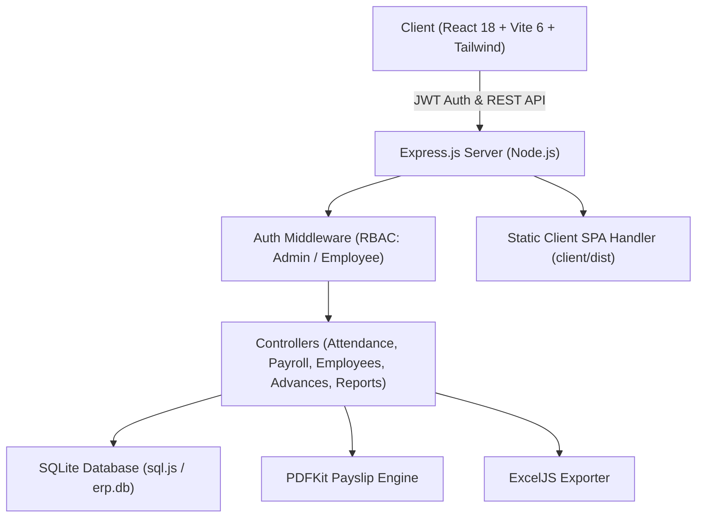
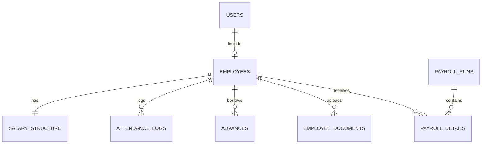
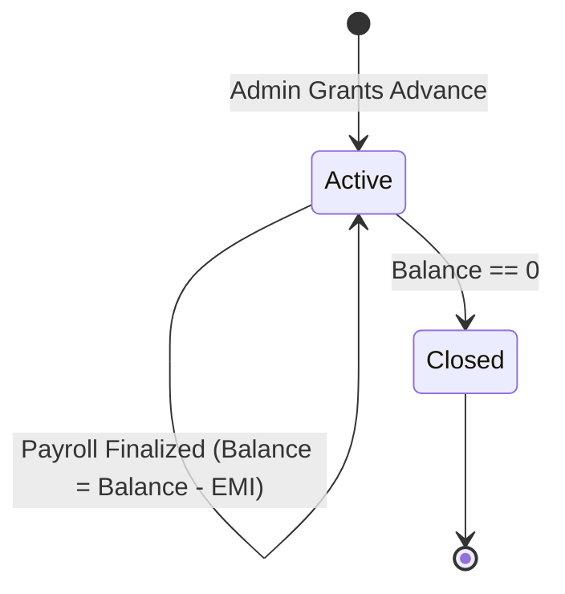

# 🧠 NexERP Pro — System Architecture & Business Logic Blueprint (BRAIN.md)

This document outlines the internal architecture, mathematical calculations, business logic engines, database schema, security flows, and design decisions behind **NexERP Pro**.

---

## 1. 🏗️ High-Level System Architecture

### Architecture Pillars:
1. **Single-Service Portability**: Express server hosts both REST endpoints (`/api/*`) and production frontend build (`client/dist`), enabling zero-config deployment on platforms like Render, AWS, and DigitalOcean.
2. **Deterministic SQL Schema**: Uses SQLite (`sql.js`) with ACID transactions, foreign keys, cascading deletes, and on-demand file persistence in `server/data/erp.db`.
3. **Role-Based Access Control (RBAC)**: Strict segregation between `admin` (global company management) and `employee` (self-service profile, punch, salary slips, loan tracking).

---

## 2. 🗄️ Database Schema & Data Models

### Core Entity Definitions:
- **`users`**: Authentication credentials (`email`, `password_hash`, `role`, `employee_id`, `status`).
- **`employees`**: Personal and work records (`emp_code`, `name`, `email`, `department`, `designation`, `doj`, `bank_account_no`, `ifsc`, `bank_name`, `avatar_url`, `status`).
- **`salary_structure`**: Base compensation breakdown (`basic`, `hra`, `other_allowance`, `pf_applicable`, `esi_applicable`, `effective_from`).
- **`attendance_logs`**: Daily punches (`punch_in_time`, `punch_out_time`, `total_hours`, `status`: `'Present'|'Half Day'|'Absent'`, `punch_in_lat`, `punch_in_lng`, `remarks`, `marked_by`).
- **`advances`**: Staff loans (`amount`, `monthly_deduction`, `balance_remaining`, `status`: `'active'|'closed'`).
- **`payroll_runs`**: Master run records (`month`, `year`, `total_gross`, `total_deductions`, `total_net`, `status`: `'draft'|'finalized'|'paid'`, `payment_date`).
- **`payroll_details`**: Individual employee line items for a run (`working_days`, `present_days`, `half_days`, `earned_salary`, `pf_deduction`, `esi_deduction`, `tax_deduction`, `advance_deduction`, `other_deductions`, `net_pay`).
- **`attendance_settings` & `payroll_settings`**: Global enterprise rules (cutoff time, late penalties, PF %, ESI %, PT tax slab).

---

## 3. ⚙️ Payroll & Statutory Calculation Engine

### 3.1. Payable Day Calculation
$$\text{Payable Days} = \text{Present Days} + (0.5 \times \text{Half Days})$$

### 3.2. Earned Gross Salary
$$\text{Monthly CTC} = \text{Basic} + \text{HRA} + \text{Other Allowances}$$
$$\text{Per-Day Rate} = \frac{\text{Monthly CTC}}{\text{Total Working Days in Month}}$$
$$\text{Earned Gross} = \text{Per-Day Rate} \times \text{Payable Days}$$

### 3.3. Statutory Deductions (Indian Payroll Rules)
1. **Employee Provident Fund (EPF)**:
   $$\text{EPF} = \text{Earned Basic} \times 12\% \quad (\text{Subject to statutory cap if configured})$$
2. **Employee State Insurance (ESI)**:
   $$\text{ESI} = \begin{cases} \text{Earned Gross} \times 0.75\%, & \text{if Gross Monthly CTC} \le ₹21,000 \\ 0, & \text{otherwise} \end{cases}$$
3. **Professional Tax (PT)**:
   $$\text{PT} = ₹200 \quad (\text{Standard state slab deduction})$$

### 3.4. Staff Advance Recovery & Net Salary
$$\text{Advance EMI} = \min(\text{Advance Monthly Deduction}, \text{Remaining Loan Balance})$$
$$\text{Total Deductions} = \text{EPF} + \text{ESI} + \text{PT} + \text{Advance EMI} + \text{Late Penalty} + \text{Other Deductions}$$
$$\mathbf{\text{Net Take-Home Pay}} = \mathbf{\text{Earned Gross}} - \mathbf{\text{Total Deductions}}$$

---

## 4. 🔄 Advance Loan State Machine

- When a payroll is **Finalized / Approved**:
  - The monthly deduction amount is automatically subtracted from `advances.balance_remaining`.
  - If `balance_remaining` reaches `0`, status transitions to `'closed'`.

---

## 5. ⏱️ Attendance Engine & Cutoff Logic

- **Standard Shift**: `09:30 AM` to `06:00 PM` (8.0 Hours).
- **Grace Cutoff**: Punches after `09:30 AM` are logged and flagged for compliance reporting.
- **Half-Day Logic**:
  - **Self-Applied**: Submits slot (`First Half` or `Second Half`) with mandatory audit reason.
  - **Punch-Calculated**: Working between $\ge 4.0\text{ hrs}$ and $< 8.0\text{ hrs}$ is classified as a Half Day session ($0.5$ attendance credit).
- **Live Session Timer**: Frontend computes elapsed time client-side from `punch_in_time` with 1-second interval sync.

---

## 6. 📄 PDFKit Payslip Generation Pipeline

The backend PDF engine (`server/src/services/pdfService.js`) builds pixel-perfect salary slips:
1. **Header**: Company metadata, logo icon, and salary slip period.
2. **Employee Metadata Grid**: Name, Employee Code, Department, Designation, Bank Name, Account No, IFSC, Working Days, and Present Days.
3. **Dual Table Grid**:
   - **Left Column**: Itemized Earnings (Basic, HRA, Other Allowances, Gross Earned).
   - **Right Column**: Itemized Deductions (EPF, ESI, Professional Tax, Advance Recovery, Other Deductions).
4. **Net Pay Highlight Banner**: Net salary in INR (`₹`) along with automated English currency string generator (e.g., *Rupees Seventy-Four Thousand Eight Hundred Only*).
5. **Footer**: Computer-generated validity disclaimer and authorization seal.

---

## 7. 🛡️ Security & Authentication

- **Password Storage**: Passwords hashed with `bcryptjs` (salt rounds: 10).
- **JWT Verification**: Bearer token validated via `verifyToken` middleware on protected routes.
- **Role Validation**:
  - `isAdmin`: Restricts payroll generation, employee creation, and company report exports to administrators.
  - `isEmployeeOrAdmin`: Grants access to self-service endpoints (own payslips, attendance calendar, loan status).
- **Input Sanitization**: Parameterized SQLite queries to eliminate SQL injection vulnerabilities.

---

## 8. 📱 Responsive & Mobile Touch Design Architecture

- **Mobile Viewport Strategy**: Adaptive layout using Tailwind responsive breakpoints (`sm:`, `md:`, `lg:`).
- **Touch Targets**: Minimum 44px tap targets for buttons and interactive controls on touch devices.
- **Horizontal Carousels**: Tab navigations equipped with `no-scrollbar` and smooth momentum scrolling (`-webkit-overflow-scrolling: touch`) for phones.
- **Modals**: Centered overlays with `max-h-[85vh]` and internal custom scrolling to maintain visibility over mobile software keyboards.

---

## 9. 📈 Extensibility & Future Enhancements

- **Biometric Hardware API**: Direct Webhook listener for biometric fingerprint/face scanners (ZKTeco / ESS).
- **Multi-Branch & Geo-Fencing**: Geofence radius boundary check on `punch_in_lat` / `punch_in_lng`.
- **Automated Bank NEFT File Generation**: Generate standard ICICI / HDFC / SBI bulk salary upload files.
- **Tax Declaration Portal**: 80C, 80D, and HRA rent receipt upload & automated Old vs New Tax Regime calculator.
